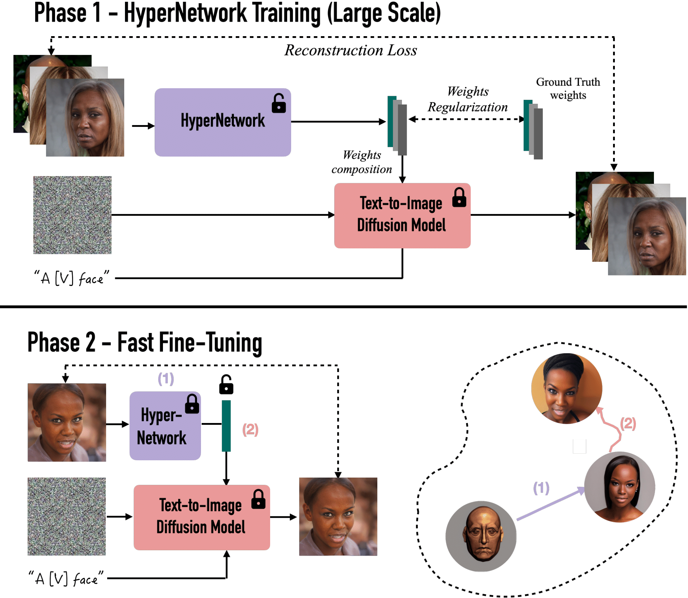
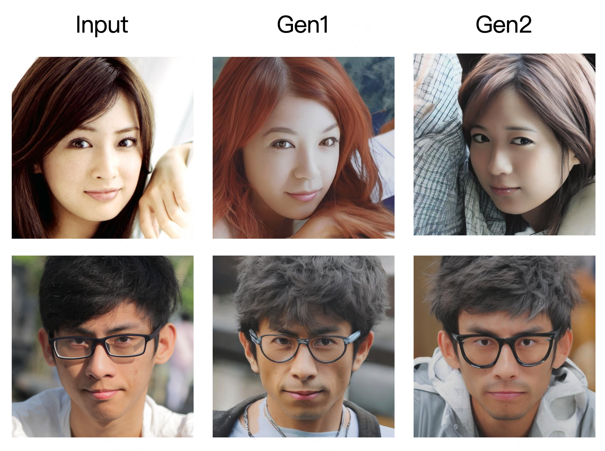

# HyperDreamBooth

## Overview

In this project, I provide a diffusers based implementation of [HyperDreamBooth: HyperNetworks for Fast Personalization of Text-to-Image Models]https://arxiv.org/abs/2307.06949)
Some of the codes come from this project：https://github.com/KohakuBlueleaf/HyperKohaku?tab=readme-ov-file

## Main Steps

### 1.Lightweight DreamBooth

Run the scripts below to test if Lightweight DreamBooth is working properly. It should generate normal images just like a standard LoRA.

`sh train_dreambooth_light_lora.sh`
`python T2I_inference.py`

### 2.Weight Pre-Optimization

Run the scripts for pre-optimization of weights, then export the corresponding LoRA according to the Identity. It supports batch training.

`sh train_preoptnet.sh`
`python export_preoptnet_weight.sh`
`python T2I_inference.py`

### 3.Hypernet Training

Run the scripts for hypernetwork training, then export the corresponding LoRA based on the input image.

`sh train_hypernet.sh`
`sh export_hypernet_weight.sh`
`python T2I_inference.py`

### 4.Rank Relaxed Fast Finetuning

The Rank-Relaxed Fast Finetuning can be executed by merely adjusting the LoRALinearLayer. It comprises two LoRA structures: a frozen LoRA(r=1), initialized with the weights predicted by the Hypernet, and a trainable LoRA(r>1) with zero initialization. The frozen and trainable LoRA need to be merged and exported as a standard LoRA, which is then restored for fast finetuning. 

The detailed steps are as follows:

1. Merge the linear layers in the frozen and trainable LoRA into a single linear layer. This can be achieved with simple multiplication or addition operations on their weight matrices, We can easily obtain:
   Rank(merged_lora) ≤ Rank(frozen_lora) + Rank(trainable_lora).

2. Apply SVD decomposition (with the diagonal matrix absorbed to the left) to the weight matrix of this newly merged linear layer to derive the final LoRA's Up and Down matrices. By retaining all non-zero singular values (N=Rank(merged_lora)), the SVD truncation error becomes zero, which is exactly our objective.

3. Restore the weights of the merged LoRA and perform a standard LoRA finetuning. It should take approximately 25 steps.

   `python rank_relax.py`
   `sh fast_finetune.py`
   `python T2I_inference.py`

### 5.Experiments

1. Set appropriate hyperparameters to directly train light_lora, ensuring that the results are normal. Then, conduct batch training of light_lora in preoptnet for all IDs.

2. When only utilizing the hypernetwork prediction, there are some flaws in the local details.
3. Implementing rank-relaxed fast fine-tuning based on the hypernetwork prediction reduces the training steps to 25, significantly improving the results. 

4. If combined with the style of LoRA, the effect is as follows. 

5. If the Down Aux and Up Aux are set to be learnable,  there is no need for the Weight Pre-Optimization and Fast-finetuning process, and the results are even better.
`sh train_hypernet_pro.sh`
`sh export_hypernet_weight.sh`
`python T2I_inference.py`

------

## Main Contributor

chenxinhua: chenxinhua1002@163.com
